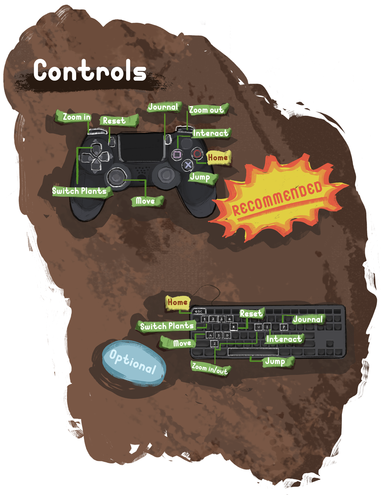
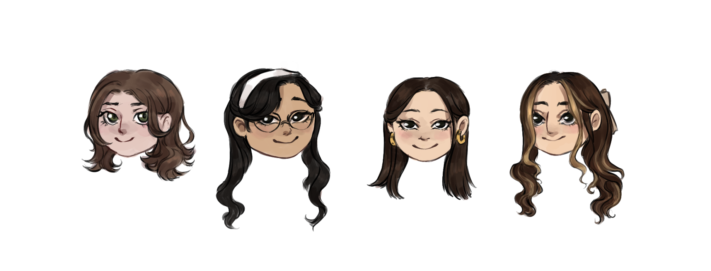

# UPROOTED - Leaf no one behind

*A Student's semester project as part of [Game Design](https://gamedesign.htw-berlin.de)
at [HTW Berlin](https://www.htw-berlin.de/) made in Unity. Play the game [here](https://kimiyae.itch.io/uprooted)*

## Embark on a botanical adventure!
Uprooted is a cozy 2D puzzle platformer that let ́s you step into the pot of a little cactus, who finds itself abandoned in a dusty attic with a newfound mission to make a pot-tastic escape with other neglected houseplants.
Set in a vibrant and cozy Mid-Century family home, you ́ll encounter brain-teasing puzzles that will challenge your leafy intellect.
Uncover new abilities as you rescue other plants, use their botanical powers to overcome obstacles as you make your way through the house.

Beware: Plants need water to survive!
Manage your plants’ abilities wisely as you navigate through each room, every interaction requires a certain amount of energy.

## Meet the Gang:
Venus Flytrap, the Sticky-Fingered Sidekick who will always lend you a hand ... or a mouth?

Aloe Vera, the leafy companion with extending leaves!

Ivy, the vine-sational helper for reaching great heights.

Are you ready to team up with this botanical bunch for a rootin', shootin' and lootin' adventure of epic proportions?
Get ready to laugh, strategize, and have fun destroying as much of the house as you can and embrace the wild side of houseplants during your spikey escape!

## How to Play

# Team

* [Marlen Schröder](https://github.com/atlass07)
* [Angelina Nguyen](https://github.com/Angel111na)
* [Quynh Vi Trinh](https://github.com/quynhvi)
* [Kimiya Hossainpour](https://instagram.com/aendromeda)

## Resources
#### Asset Store and Packages contents

Unity Technologies: [Cinemachine](https://unity.com/unity/features/editor/art-and-design/cinemachine)

Unity Technologies: [Universal RP](https://docs.unity3d.com/Packages/com.unity.render-pipelines.universal@11.0/manual/)

Unity Technologies: [InputSystem](https://docs.unity3d.com/Packages/com.unity.inputsystem@1.0/manual/Interactions.html#default-interaction)

Unity Technologies: [TMP](https://docs.unity3d.com/Manual/com.unity.textmeshpro.html)

#### Background Music
Julius H - Cool Jazz Loops (https://pixabay.com/de/music/traditioneller-jazz-cool-jazz-loops-2641/)
